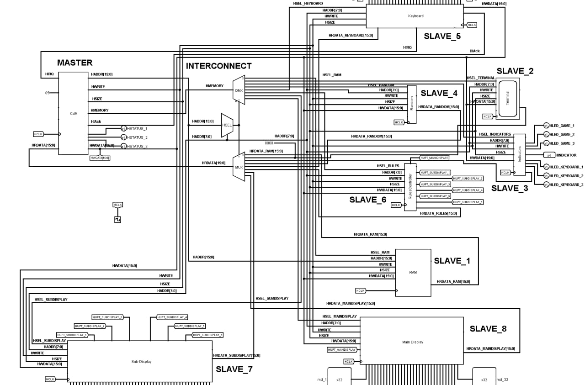
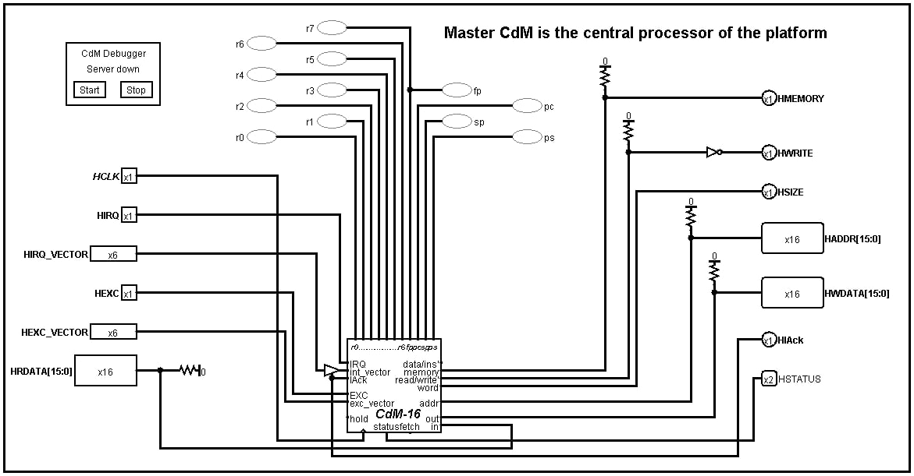
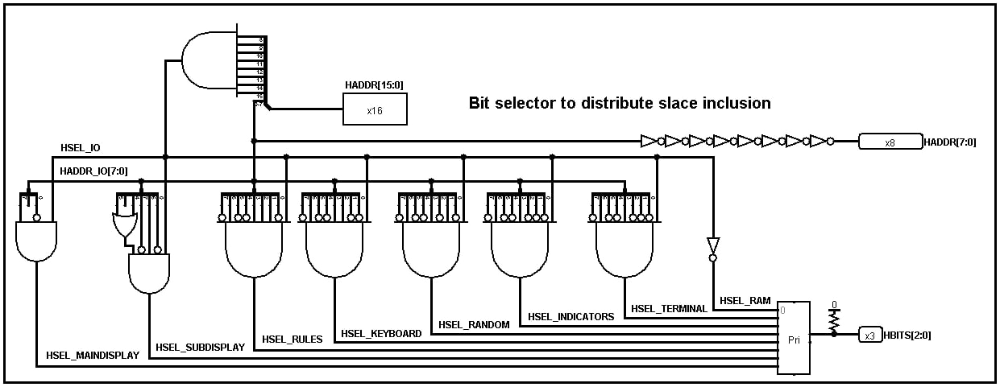
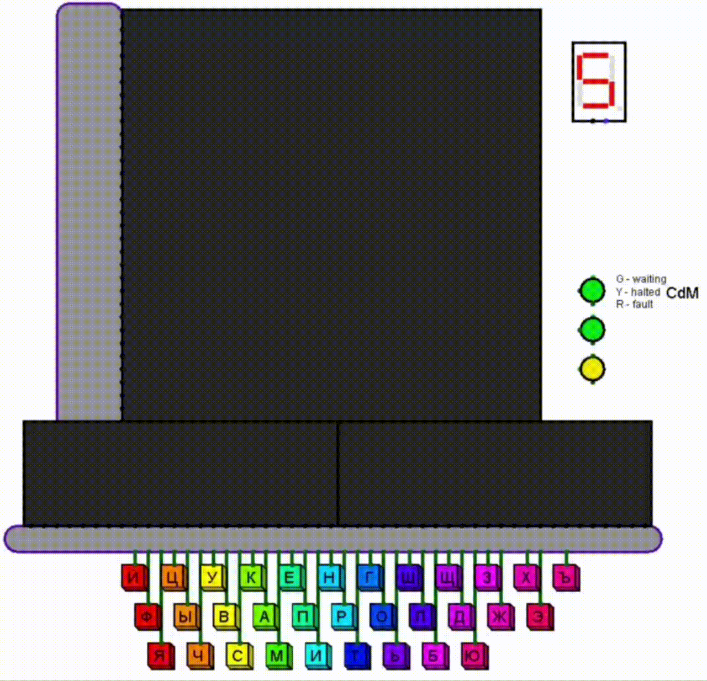
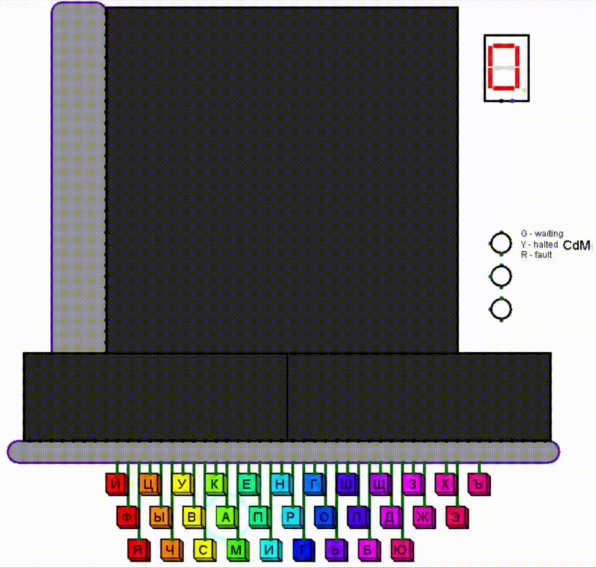

<h1 align="center">
  🚀 CdM16 × AMBA AHB‑Lite Demo Platform 🖥️
</h1>

<p align="center">
  <em>Hands-on digital‑design playground powered by a 16‑bit CdM CPU and a full AMBA AHB‑Lite bus.</em>
</p>

<p align="center">
  
  
  
  
</p>

---

## Table of Contents

1. ❓ [Why this project?](#why-this-project)
2. 🛠️ [Hardware overview](#hardware-overview)
3. 🗺️ [Memory map](#memory-map)
4. 🔔 [Interrupts](#interrupts)
5. 🎮 [Demo application — Hangman 🪢](#demo-application--hangman-)
6. 🚀 [Getting started](#getting-started)
7. 🗂️ [Project layout](#project-layout)
8. 📄 [License](#license)

---

## ❓ Why this project? 

> *“Stop teaching bus interfaces with toy protocols.”*
> — someone in our digital‑logic class, probably.

* 🏭 **Industrial standard.** AMBA AHB‑Lite is what real chips speak; no cut corners.
* 🛠️ **Open tooling.** Runs entirely in Logisim + a few open‑source plugins.
* 🍔 **Full stack.** From Verilog‑style schematics → assembly code → playable game.

All the gory details live in the repo so you can **clone, run, and hack away**.

---

## 🛠️ Hardware overview

| Block                         | Function                                     |
| ----------------------------- | -------------------------------------------- |
| **Master — CdM16 CPU**        | 16‑bit RISC core provided by the university. |
| **Interconnect_BitSelector** | Custom address decoder / HSEL generator.     |
| **Slave 0 – RAM**             | 64 kB unified program + data memory.         |
| **Slave 1 – MainDisplay**     | 32 × 32 bitmap “gallows” canvas.             |
| **Slave 2 – SubDisplay**      | 32 × 8 text line for guessed letters.        |
| **Slave 3 – RulesController** | Freeze / refresh logic for both displays.    |
| **Slave 4 – Terminal**        | Debug console (mapped to `0xFF46`).          |
| **Slave 5 – Indicators**      | 3‑LED status cluster (green / yellow / red). |
| **Slave 6 – Random**          | LFSR‑based RNG for word selection.           |
| **Slave 7 – Keyboard**        | 33‑key RU‑layout matrix → IRQ 5.             |

<br/>

<div align="center">








</div>

---

## 🗺️ Memory map

| Address range     | Size   | Slave               | Notes          |
| ----------------- | ------ | ------------------- | -------------- |
| `0x0000 – 0xFEFF` | 0xFF00 | **RAM**             | Code + data    |
| `0xFF46`          | 1 word | **Terminal**        | R/W            |
| `0xFF48`          | 1 word | **Indicators**      | W              |
| `0xFF4A`          | 1 word | **Random**          | R              |
| `0xFF4C`          | 1 word | **Keyboard**        | R (clears IRQ) |
| `0xFF4E`          | 1 word | **RulesController** | W              |
| `0xFF50 – 0xFF7F` | 0x30   | **SubDisplay**      | W              |
| `0xFF80 – 0xFFFF` | 0x80   | **MainDisplay**     | W              |

All peripherals are memory‑mapped; **no special I/O instructions required**.

---

## 🔔 Interrupts

| Vector | Source           | Purpose            |
| ------ | ---------------- | ------------------ |
| 0      | **Reset / Main** | Program entry      |
| 1–4    | *Reserved*       | Fault traps        |
| **5**  | **Keyboard**     | User keypress      |
| 6–15   | *Available*      | Extend as you like |

Enable interrupts in the status register and you’re good. ⚡

---

## 🎮 Demo application — Hangman 🪢

| Win                                          | Lose                                          |
| -------------------------------------------- | --------------------------------------------- |
|  |  |

* 256 Russian 6‑letter words, LZ‑packed in ROM.
* RNG picks a secret word, game logic lives in `src/asm/main.asm`.
* Display updates use double‑buffer & freeze‑refresh via RulesController.
* No external dependencies beyond the supplied JAR plugins.

---

## 🚀 Getting started 

### 0. Prerequisites

| Tool                      | Tested version | Notes                                                                                  |
| ------------------------- | -------------- | -------------------------------------------------------------------------------------- |
| **Logisim**               | `3.8.0`        | [https://sourceforge.net/projects/circuit/](https://sourceforge.net/projects/circuit/) |
| **logisim‑cdm‑emulator**  | `0.2.2`        | in `lib/`                                                                              |
| **logisim‑banked‑memory** | `0.2.2`        | in `lib/`                                                                              |
| **logisim‑debugger**      | `0.2.2`        | in `lib/`                                                                              |
| **cdm‑assembler**         | any            | we use the uni‑supplied one                                                            |

### 🐑 1. Clone 

```bash
git clone https://github.com/your-user/cdm16-amba-ahb-demo.git
cd cdm16-amba-ahb-demo
```

### 🛠️ 2. Assemble the demo program 

```bash
cd src/asm
cocos main.asm        # → build/out.img
```

### 🏃 3. Launch the simulation

```bash
logisim src/logisim/main.circ
```

Hit **🟥 Reset**, then **▶️ Run**.
Type any Russian letter on the on‑screen keyboard — IRQ 5 will fire and the game begins.

---

## 🗂️ Project layout 

```text
cdm16-amba-ahb-demo/
├── lib/                  # custom Logisim libraries (JARs)
├── src/
│   ├── asm/              # CdM16 assembly
│   │   ├── build/        # compiled images
│   │   └── main.asm
│   └── logisim/          # schematics
│       ├── cdm16.circ    # CPU core (read-only)
│       └── main.circ     # top-level project file
└── README.md             # you’re reading it
```

---

## 📄 License 

This repository is released under the **GNU License**.
See [`LICENSE`](LICENSE) for the full text.

---

> *Feel free to open issues, PRs, or just ping me on Telegram if you build something cool on top of this platform!* 💬
